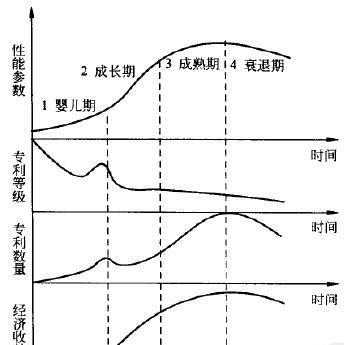
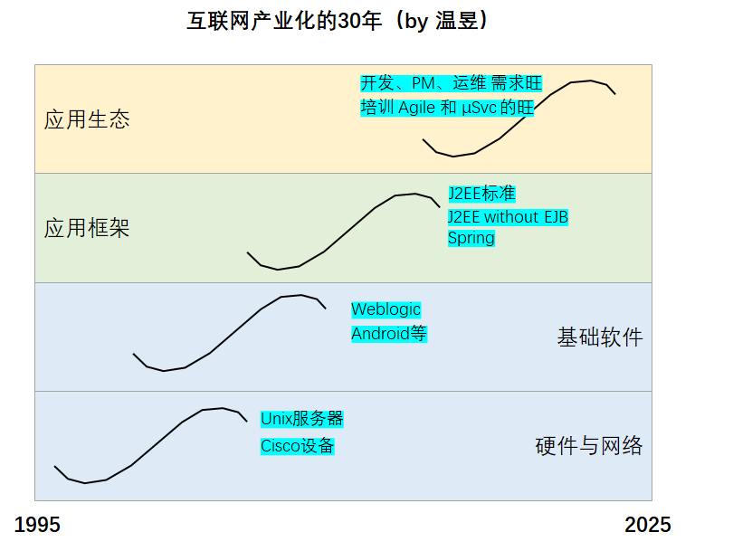
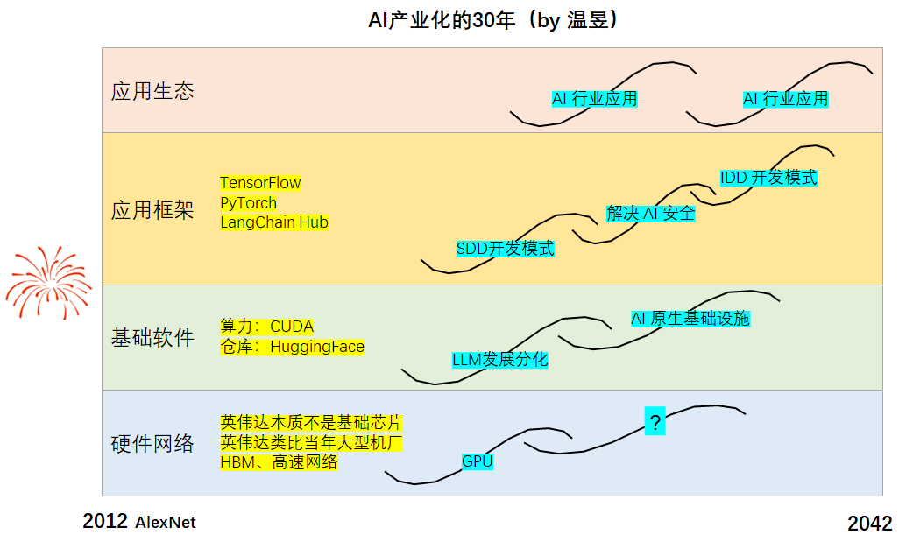

# AI 走到哪儿了：程序员失业倒计时？

## S 曲线基础

技术系统的 S 曲线，描述了技术从诞生到衰退的完整生命周期。其进化轨迹呈 S 形曲线，分为婴儿期、成长期、成熟期和衰退期四个阶段，各阶段具有不同的性能、专利和经济效益特征。

**婴儿期**：技术处于萌芽阶段，效率低、可靠性差、问题多，未来发展方向难以预测，风险较高。此时专利级别高但数量少，因技术不成熟导致经济效益为负，通常只有少数创新者或风险投资者参与。例如，早期电动汽车因电池技术限制，续航短、成本高，市场接受度低。

**成长期**：技术性能快速完善，专利数量上升但级别下降（因技术逐渐公开），经济效益显著提升，吸引大量资本和竞争者进入。例如，智能手机在 2010 年后因触摸屏、应用生态等技术的成熟，销量和利润快速增长。

**成熟期**：技术性能趋于稳定，专利数量仍较多但级别进一步下降（创新以微改进为主），经济效益达到峰值。此时市场饱和，竞争转向成本和服务。例如，传统燃油汽车技术已高度成熟，专利多集中于细节优化，但利润空间因竞争压缩。

**衰退期**：技术性能基本停滞，专利数量和级别双下降，经济效益下滑。衰退通常由替代技术出现（如数码相机取代胶片）或需求减少（如功能手机被智能机替代）引发。例如，传统胶片摄影技术因数码技术普及而逐渐退出市场。

## 互联网的路径回顾

互联网产业化的四层递进发展：

1. **硬件与网络**：Unix 服务器、Cisco 设备，奠定了物理基础。
2. **基础软件**：WebLogic、Android 等，提供了运行时和开发环境。
3. **应用框架**：J2EE 标准、Spring 等，定义了开发范式，让应用开发变得高效。
4. **应用生态**：Agile、微服务、大量的开发/PM/运维岗位，形成了繁荣的产业生态。

这是一个从下到上、从基础到应用的演进过程。

## AI 行业的当前位置

所以，AI 行业目前正处于**互联网 1998-2002 年的阶段**：

- 硬件底座已经搭好。
- 基础软件（WebLogic）正在快速发展。
- 安全问题（含幻觉问题）还没有解，如果卡在这里就无法进入【应用生态爆发阶段】。
- 应用框架（J2EE/Spring）和繁荣的应用生态，还在未来的路上。下有 PyTorch、上有 LangChain 等，但**AI 的 J2EE 还没出现**，行业还在等待一个能像 J2EE/Spring 那样，定义开发范式、大幅提升效率、囊括安全设施、催生应用爆发的"标准框架"。

当前 AI，正处于"基础软件"向"应用框架"过渡的爬坡期。

| 互联网产业化阶段 | 代表技术/产品 | AI 行业对应阶段 | 现状描述 |
|:--|:--|:--|:--|
| **硬件与网络** | Unix 服务器、Cisco 设备 | **AI 算力与网络** | ✅ **已成熟**。以 GPU（NVIDIA H100/A100）、TPU、AI 芯片和高速网络为代表的算力基础设施，已经非常成熟，是 AI 发展的坚实底座。 |
| **基础软件** | WebLogic、Android 等 | **AI 基础软件** | ⚠️ **正在爆发**。以 PyTorch、TensorFlow、ONNX Runtime、vLLM、LangChain、LlamaIndex 等为代表的 AI 框架和运行时，正在快速迭代和普及，相当于互联网的 WebLogic 时代。 |
| **应用框架** | J2EE 标准、Spring | **AI 应用框架** | ❌ **尚未出现**。目前还没有像 Spring 那样，能一统江湖、大幅降低 AI 应用开发门槛的"杀手级"框架或行业标准。 |
| **应用生态** | Agile、微服务、大量岗位 | **AI 应用生态** | ❌ **远未成熟**。AI 原生应用、成熟的商业模式、规模化的 AI 岗位和开发流程，都还在探索和萌芽阶段。 |

## 短期看——初级岗大幅萎缩、中级岗要求全栈

1 个资深 + AI ≈ 3~5 个纯初级，导致**纯初级岗位大幅减少**。

**AI 协作型研发岗位**——要求会用 AI、审核代码、懂业务，换句话说就是"全栈工程师"。

2020 年的"中级纯技术人才"，到了 2026 年，要求 AI 协作能力 + 业务能力 + 基础架构能力。**不进化，会被淘汰。**

> **未来 3 年：产业界大规模非技术人员编程？不可能！**

## 中期看——期待 AI 应用生态的爆发

到 AI 应用生态爆发，理论上岗位会增加。因为，CodeGenAI 生成代码量的激增，要求更多的工程师审查和测试代码，诊断和优化设计。

> 参考：[Morgan Stanley: AI Software Development Industry Growth](https://www.morganstanley.com/insights/articles/ai-software-development-industry-growth)

## 长期看——从 SDD，到 IDD

**SDD**：Spec-Driven Development 规格驱动开发

**IDD**：Intention-Driven Development 意图驱动开发

有 AI 也好，无 AI 也罢，从企业业务 or 个人价值 → 到系统能力 → 到系统设计 → 到系统实现……这个逻辑主线并不变。

所以，一旦 AI 掌握了**自动需求分析**和**"正向 reasoning 反向 tracing 双向闭环"**的能力，所谓的"意图编程"或"意图驱动开发"就可能成为现实。

> **到了那时，非技术人员描述意图，AI 自动填坑完成需求分析、编程和测试，可能就是普遍现象了。**
