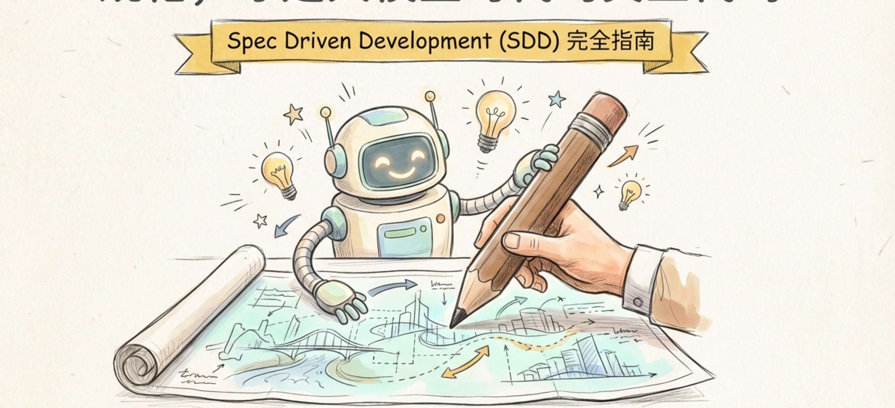
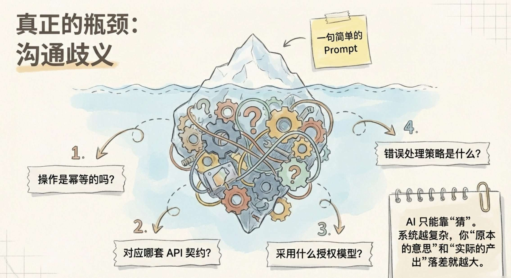
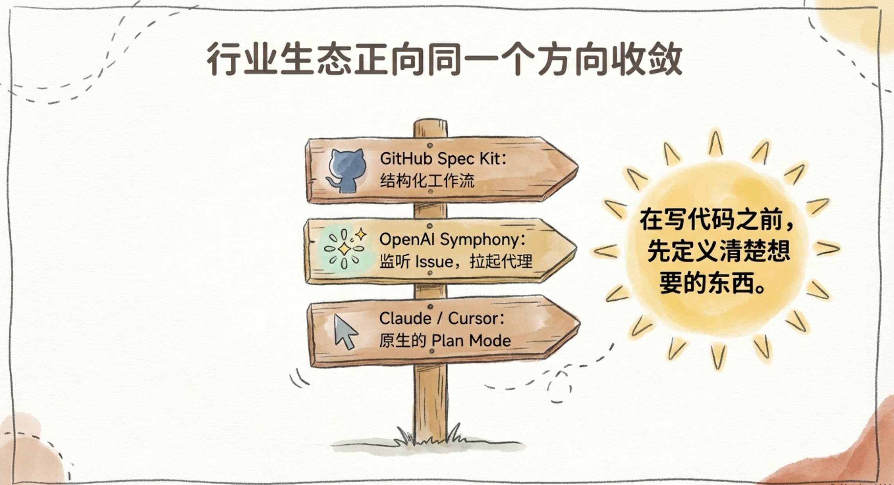
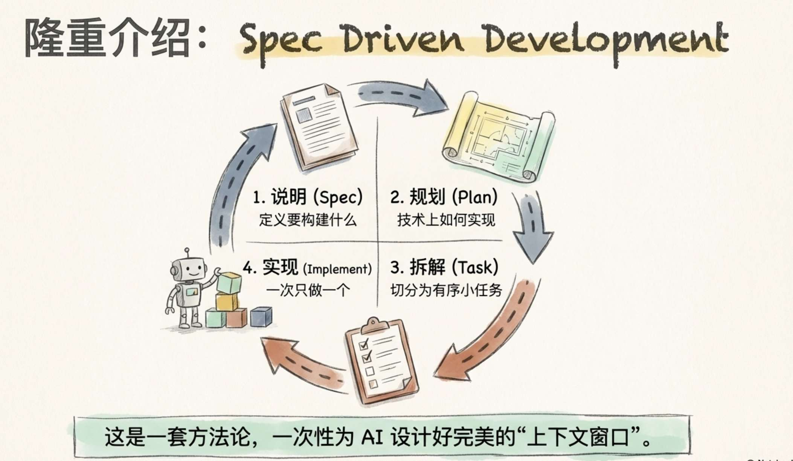
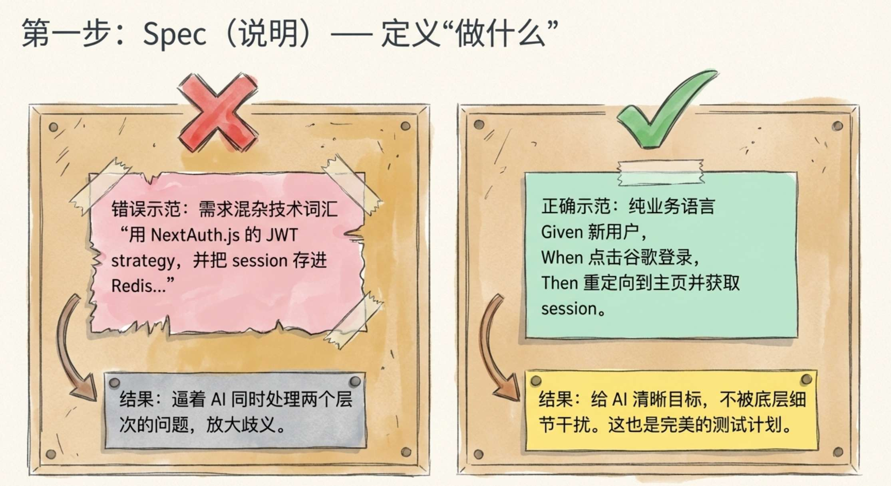
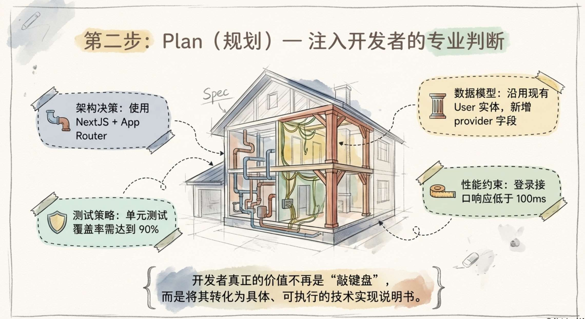
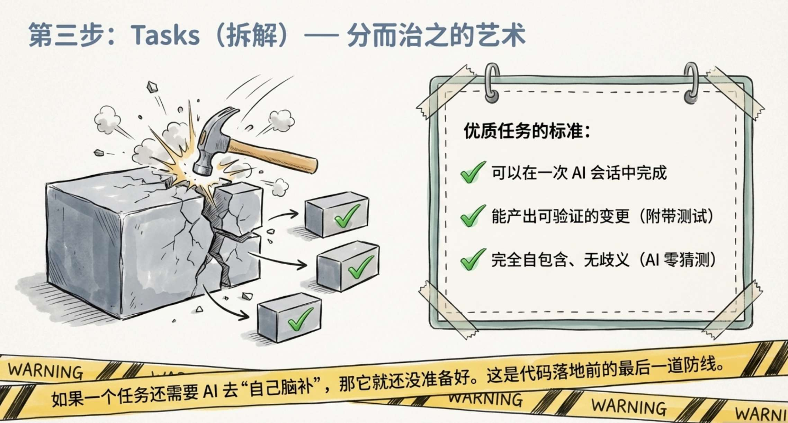
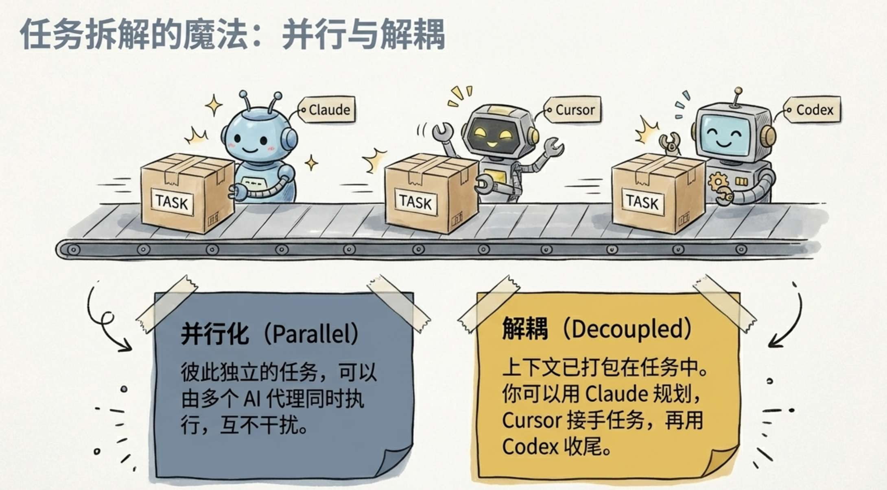
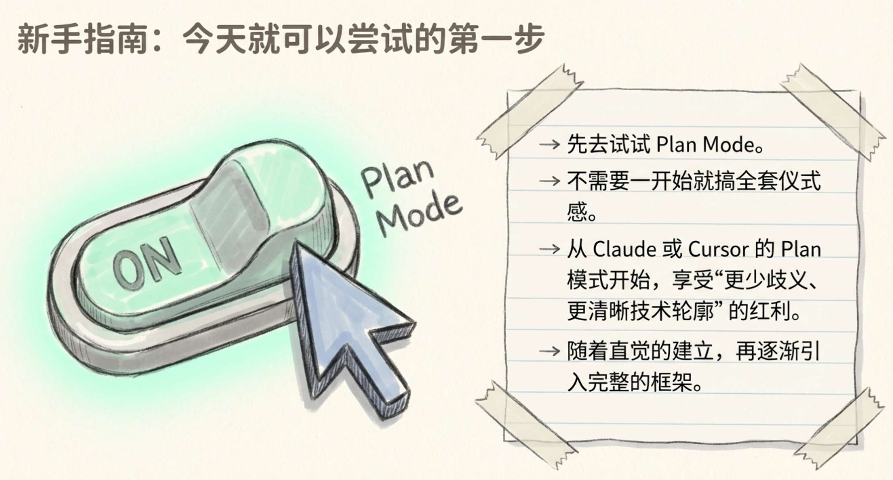
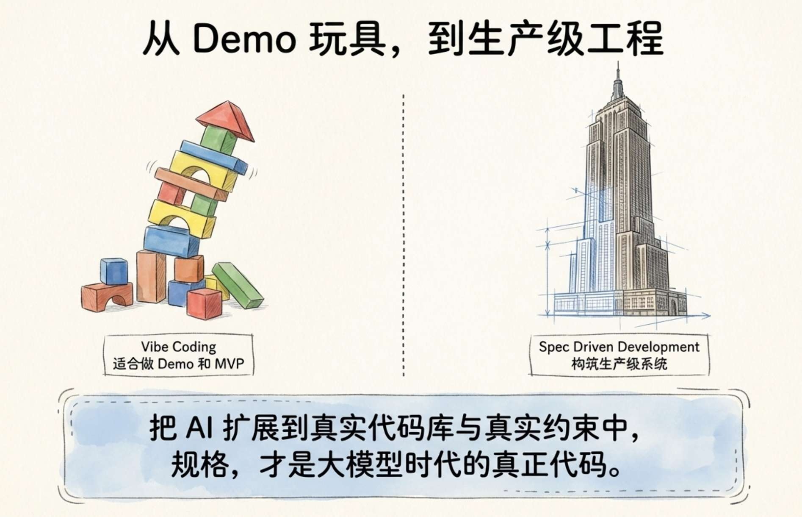

AI coding agent之所以效果不太好，往往不是因为模型太弱，而是因为指令含糊不清，代理所依赖的 harness（约束与支撑机制）又不够强。

这也正是为什么，整个行业都在构建规格（spec）和 agent harness。

## 真正的瓶颈

关于 AI Coding Agent，有一个不太好听、但必须承认的事实：

**最大的瓶颈，不是模型，不是上下文窗口，也不是工具链，而是下指令的人。**

很多人刚开始用 coding agent 时，互动通常是这样的：

> “加一个从 backoffice 管理商品的功能。”

代理读完代码库，挑了一个看起来合理的模式，然后把功能写出来。 乍一看，好像没问题。

可等你再点一次 “add item”，它就把同一条商品插入了两次。

这时，那些你原以为“理所当然”的前提，突然全都暴露出来了：

- 这个操作应该是 **幂等的** ；
- 只有管理员才允许执行；
- 所谓 “the backoffice”，指的是 **内部后台** ，不是面向商家的那个后台。

问题在于： **这些信息根本没有写进 prompt。**

代理只能自己猜：

- 是哪个 backoffice？
- 对应哪套 API contract（接口契约）？
- 用哪一层存储？
- 采用什么授权模型？
- 错误处理策略是什么？

这些全都是“沉默的决策”。 有些它猜对了，有些猜错了。

而且系统越复杂，你“原本想表达的意思”和“代理实际实现出来的东西”之间的落差就越大。

这就是 **歧义问题** 。

这不是代理的错。 本质上，这是一个 **沟通问题** 。

## 为什么整个生态都在往同一个方向收敛

整个 AI 编程生态，正在不约而同地走向同一种解法。

看看现在正在发生什么：

- **GitHub 的 Spec Kit（7.7 万星）** ：把 spec → plan → task → implement 这一整套流程结构化；与具体 agent 无关，可用于 Claude Code、Cursor 等多种工具。
- **OpenAI 的 Symphony** ：监听你的 issue tracker，为每个 issue 拉起 автономous agent（自主代理），并要求用 SPEC.md 作为契约。
- **The Ralph Loop** ：把 PRD（产品需求文档）放进一个无限循环的 agent 工作流中；进度保存在文件和 Git 里，而不是上下文窗口里。

甚至连 coding agent 自己，也在原生地朝这个方向演进。

Claude Code 和 Cursor 里的 **Plan mode** ，本质上就是一个轻量版的“先写 spec 和 plan”步骤。 而 **任务拆解** ，现在几乎已经成为大多数 agent loop 的标配。

这些工具虽然架构不同、理念各异，但都共享一个核心思想：

> **在写代码之前，先把你想要的东西定义清楚；然后再让代理根据结构化规格去实现。**

这就是 **Spec Driven Development** 的核心。

## 什么是 Spec Driven Development？

**Spec Driven Development（SDD）** 是一种 **方法论** ，不是一个工具。

它的流程很简单，分成四步：

1. 说明你要构建什么；
2. 规划从技术上如何实现；
3. 把工作拆成小而有序的任务；
4. 让代理一次只实现一个任务。

每一步都在减少歧义。

等到代理真正开始写代码时，它已经拿到了所需的一切：

- 这个功能要做什么；
- 它要如何接入现有系统；
- 边界情况有哪些；
- 测试要验证什么；
- 应该遵循什么架构。

代理不需要再猜。

当你把一份高质量的 spec 和 plan 交给代理时，你其实是在 **一次性设计它的整个上下文窗口** ： 架构决策、逐步指导、验收标准——全部通过一组工件打包给它。

最妙的一点是： **spec 本身也应该让 agent 来帮你写。**

因为相比从零写一份 spec， **修正一份 spec 要容易得多** 。 你还可以让 agent 直接从 spec 里帮你找出歧义点。

## Spec-Driven Development 的层级

并不是所有 SDD 实践都处在同一个成熟度水平。

在这篇文章里，Birgitta Böckeler 将 spec 成熟度划分为三个层级：

## 1\. Spec-First

先写 spec，再开始编码；但功能交付后，spec 就被丢掉了。 很多团队都是从这里起步的，而仅仅做到这一步，就已经足以在这一轮开发中显著减少歧义。

## 2\. Spec-Anchored

spec 与代码一起存在于仓库中，并随着代码持续演化。 这时，spec 不再是一次性文档，而变成团队的 **活文档** 。

## 3\. Spec-as-Source

spec 成为主工件。 你改的是 spec，代码则根据 spec 重新生成并保持一致。

这是更前沿的方向。我们还没有完全走到那一步，但趋势已经非常明确。

所以，Spec Driven Development 不是“做”或“不做”的二元选择。 它是一种 **渐进式方法论** 。

先从第一级开始，拿到收益； 再根据需要，决定要不要继续往更深处走。

接下来，我们把 SDD 的每一步拆开来看。

## Spec：定义“做什么”，而不是“怎么做”

spec 是 **功能层** 。

它描述的是这个功能 **要完成什么** ，而不是 **如何实现** 。 它刻意保持技术无关。

一份好的 spec，应该用非技术语言定义清楚这些内容：

- 功能目的；
- 使用场景；
- 需求；
- 边界情况；
- 成功标准。

这里有一个关键洞察：

> **把功能描述和技术实现分离，可以显著降低 LLM 的不确定性。**

如果你把：

> “用户可以用 Google 和 GitHub 登录”

和

> “使用 NextAuth.js 的 JWT strategy，并把 session 存进 Redis”

混在一起写，你等于逼着代理同时处理两个不同层次的问题。

功能需求可能本身是清楚的， 但技术决策会引入分叉路径，进而放大歧义。

相反，如果 spec 只保持在功能层，你给代理的就是一个清晰目标，而不会让它被过早的实现细节干扰。

更重要的是，这也让你可以在 **写任何一行代码之前** ，就先定义清楚边界行为。

验收标准通常使用 **Given / When / Then** 格式，以最大限度消除验证歧义：

- **Given** 一个新用户， **When** 他点击 “Sign in with Google” 并授权应用， **Then** 他会被重定向到 dashboard，并拿到有效 session。
- **Given** 一个已经绑定 Google 账号的用户， **When** 他尝试用相同邮箱通过 GitHub 登录， **Then** 两个账号会被关联到同一个 profile，并访问同一个账户资料。

这些不只是文档。 它们实际上就是 **测试计划** 。

代理可以据此验证自己的实现是否正确。

## Plan：开发者真正注入专业判断的地方

plan 是 **技术层** 。

它是代理的实现指南： 告诉代理，如何把 spec 中描述的内容真正落地。

这也是开发者专业能力最关键的地方。 不是体现在“亲手写代码”，而是体现在 **做架构决策** 上，例如：

- **架构与技术决策** ： “使用 NextJS + App Router，遵循 @auth-rules 中已有的认证模式。”
- **数据模型与契约** ： “沿用现有的 User 实体，新增一个 provider 字段。”
- **测试策略** ： “认证流程的单元测试覆盖率必须达到 90%。”
- **性能约束** ： “登录接口响应时间低于 100ms。”

在 plan 里，你会引用自己的自定义规则、指出代码库中已有的实现模式、指定代理该调用哪些 MCP，并设定技术边界。

它把抽象的 spec，转化为一份 **具体、可执行、边界清晰的实现说明书** 。

还有一点让它格外有效：

> **plan 可以结合自动化研究能力，以及你当前的 agent harness。**

例如 Spec Kit 的 /plan 命令，在生成技术计划之前，会先读取你的真实代码库。 它会分析当前结构，识别已有模式与约定，再提出一套与现有系统保持一致的架构建议。

## Tasks：分而治之

接下来，plan 会被拆成一系列小而有序的任务。

每个任务都应该满足两个条件：

- 可以在 **一次 agent session** 中完成；
- 能产出一个 **可验证的变更** ，并附带测试。

关键在于：

> **每个任务都必须自包含、无歧义。**

代理不该为了完成任务再去做额外猜测，也不该为了补足上下文而到处搜索。

只要一个任务还要求代理“自己补脑”，那它就还没准备好。

这也是开发者要再次审视方案的时刻。

你的工作，是检查任务列表有没有 **过度设计** ：

- 真有必要拆成 7 个任务吗，还是 3 个就够？
- 代理是不是开始引入不必要的抽象层？

任务拆解，是代码真正落地前的最后一个检查点，值得你花一分钟把它校正到务实可行。

一旦任务拆得扎实，就会解锁两个非常强大的能力：

## 并行化

彼此独立的任务，可以由多个代理同时执行。

## 与 agent 解耦

因为每个任务都是自包含的，上下文已经嵌在任务里，所以你甚至可以随时更换 agent：

- 用 Claude Code 开始；
- 用 Cursor 接一个任务；
- 再用 Codex 收尾另一个。

只要底层有像 Spec Kit 这样靠谱的框架支撑， spec 和 plan 跟着任务走，而不是跟着某一个 agent 绑定。

## 代价与权衡

Spec Driven Development 不是没有成本。

spec → plan → task 这一整套流程，会消耗 **大量 token** 。 一次完整的 SDD 会话，通常会比直接 prompt agent 多花 **2 到 3 倍，甚至更多** 的 token。

这就是权衡所在：

> **你在前面投入更多，换来的是后面显著更好的结果。**

当然，它也并不适用于所有场景。

至少在当前阶段，你还需要显式地定义每一步，因此对于小改动来说，这套流程未必划算：

- 一个小 bug fix；
- 一次配置更新；
- 一个很快就能完成的简单改动；

这些都不需要完整 spec。 这类场景，用 **Plan mode** ，甚至直接 prompt，通常就够了。

SDD 真正大放异彩的，是那些 **复杂到足以因为歧义而把 agent 带偏** 的工作：

- 涉及多文件改动的功能；
- 横跨多个业务域的特性；
- 历史包袱沉重的老仓库；
- 以及所有那种“你以为显而易见、其实一点都不显而易见”的业务逻辑。

它还有一个学习曲线。

开发者需要从：

> “描述我想要什么代码”

切换到：

> “描述我需要什么行为”

这不是措辞变化，而是 **思维方式的变化** 。

## 我们如何实际该如何做？

## 第一，习惯迁移

开发者早已习惯直接跳进代码。 让他们先写 spec，第一反应通常都是：这不是额外负担吗？

直到他们真正看到结果为止。

我们很早就意识到，想让大家理解 SDD 的价值，最好的方法不是去“解释它”，而是让他们 **亲手实践它** 。

所以我们几乎把重心全押在了动手工作坊上。

在一场完整的 workshop 里，开发者会：

- 写 spec；
- 生成 plan；
- 把 plan 拆成 task；
- 再和 agent 一起完成实现。

所有这些，都在同一场 session 里完成。

真正推动采用的，不是概念本身，而是这种亲身体验。

## 第二，方法之外的上下文

光有 SDD 还不够。

代理还必须理解你内部的工具、SDK，以及平台约定。 这就回到了我上一篇文章里的 **agent harness** ：

- 用自定义规则编码你的标准；
- 用 skills 打包领域知识；
- 用 MCP 把代理接入内部系统。

**方法论** 定义“要造什么”； **harness** 则提供“如何在你的环境里把它造对”的内部上下文。

## 从哪里开始

我得建议是：

> **先去亲自实践试下 Plan mode。**

它是使用 SDD 最好的起步方式。

通过这种方式，你可以体验到：

- 更少的歧义；
- 更清晰的技术轮廓；
- 更明确的意图表达；

但又不用承担完整流程的全部仪式感。

这是一个很好的起点。

等你准备更进一步时，再去采用像 **Spec Kit** 这样的专用 SDD 框架。 它能为 spec、plan 和 task 提供结构化流程；随着实现复杂度上升，它会比临时拼凑的 prompt 稳定得多，也更可扩展。

不过在开始前，你必须知道一点：

> **SDD 的价值，是会随着练习不断累积的。**

你写的第一份 spec，通常会慢、会生涩，也不会太完美。 但随着迭代次数增加，你会逐渐建立起一种直觉：

- 什么该写进 spec；
- 什么已经属于过度设计；
- 代理真正需要哪些信息，才能把事情做对。

这种能力，是一轮一轮练出来的。

**Vibe coding** 能做出 demo 和 MVP。 **Spec Driven Development** 才能构建生产级系统。

对于任何认真想把 AI agent 扩展到真实代码库、真实约束、真实后果中的组织来说， 这就是未来门槛所在。