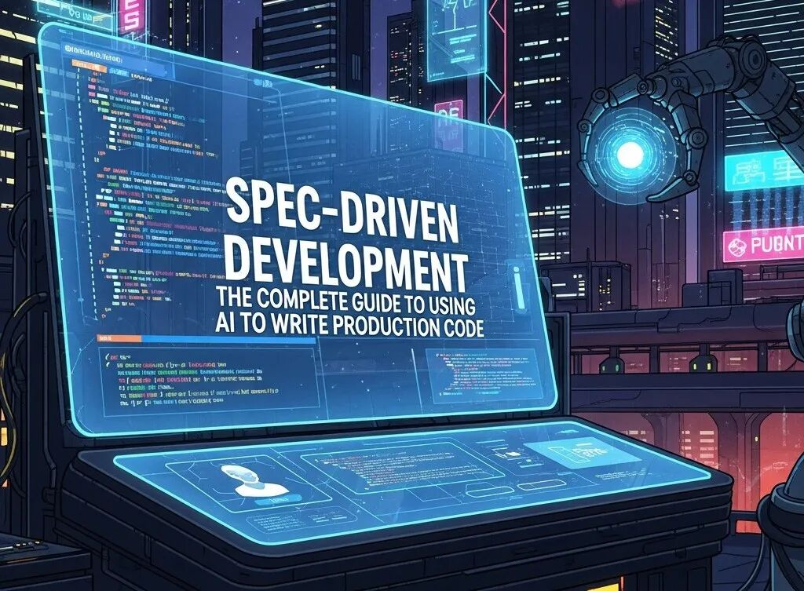

在用 Claude Code、Cursor、CodeX 等 AI 辅助写代码的你，是否也遇到过这样两难：宣传里动辄“90% 代码由 AI 生成”，现实中却频繁踩到调试时间增加、隐性安全漏洞、功能跑起来但并不满足业务需求？如何把“聊天式、灵感式”的探索编码，升级为团队可依赖、可验证、可治理的生产级流程？

答案是：**把“规范”变成事实来源，让 AI 依据规范稳定生成代码，并用系统化的校验把质量守住。**

> _以下内容译自《Spec-Driven Development in 2025: The Complete Guide to Using AI to Write Production Code》_

你可能已经在用 AI 写代码：GitHub Copilot 自动补全函数、ChatGPT 起草样板、Cursor/Windsurf 等工具层出不穷。但你也许在“宣传与现实”之间摇摆：一边是“AI 能写绝大多数代码”的乐观数据，一边是质量与安全的隐忧。

真正需要的是一套方法：它明确哪些工具适合哪些场景、如何确保 AI 生成的代码达到生产级标准、以及如何在团队中稳妥落地而不制造混乱。

这就是“规范驱动开发（Spec-Driven Development）”。核心思想是：让“形式化、可执行的规范”成为事实来源，以此引导 AI 生成一致、可维护、可上线的代码。工作流从“聊天”升级为“规范 → 计划 → 任务 → 实现”。

本文将系统覆盖：规范驱动开发是什么、是否适合你的团队、工具平台怎么选、实现流程与验证框架、以及团队采用的路线图。

### **什么是规范驱动开发，它与传统开发有何不同？**

规范驱动开发是一种方法论：用“形式化、详尽的规范”作为可执行蓝图，驱动 AI 进行代码生成。规范是事实来源，指导自动化的生成、校验与维护；你编写清晰的需求，AI 负责实现。

传统开发通常是“开发者写需求 + 写代码”，流程为“需求 → 设计 → 手写代码 → 测试”。规范驱动开发将其变为“需求 → 详细规范 → AI 生成 → 验证”。

关键差异在于：先规范、后代码；AI 根据规范实现，开发者聚焦架构、需求与验证；质量通过系统化闸门把关；并通过持续反馈把错误信息融入规范，迭代提升输出质量。

与其他方法的关系：TDD 将测试作为行为规范，规范驱动把范围扩展到完整实现；它与敏捷兼容——规范可在迭代中逐步完善。

所谓“vibe coding（氛围编码）”是指缺少规范的对话式探索，适合原型、试验与小工具，但常见问题是质量不稳定、文档缺失、技术债堆积。

规范驱动强调“有结构的规范 + 流程”，面向生产系统、企业应用、团队协作与复杂架构。这不是非此即彼——探索时用 vibe coding，生产时用规范驱动。研究也表明：只要需求清晰，LLM 在实现上表现极佳。输出质量与规范的详尽度/清晰度成正相关：模糊输入只会得到模糊代码，详尽规范能带来一致、可维护的生产级代码。

### **为什么在 AI 辅助开发中，规范正在成为事实来源？**

技术层面的原因很直观：上下文窗口已足够大（200K+ tokens），可以处理完整规范；模型能理解 OpenAPI、JSON Schema、结构化文档等形式化描述。

业务层面的收益更关键：规范可在不同 AI 工具间复用，降低供应商锁定；文档自然融入开发过程；架构决策被显式记录；团队通过“规范评审”协作；合规与审计通过规范历史实现。

质量控制变得系统化：先验证规范，再生成代码；测试需求在前置阶段定义；安全要求明确；性能约束写在规范里；“上线就绪”的标准在实现前就确定。

ROI 方面：前期编写规范需要数小时，但手写实现往往是数天/数周；类似特性的复用让后续成本下降；因需求清晰而减少调试时间；显式的验证标准减少生产事故；新人入职因有规范而更快上手。

具体案例：Google 的 AI 工具包在迁移中生成了多数必要代码，实现了已落地变更中 80% 的代码由 AI 撰写、总迁移时间减少 50%；Airbnb 在六周内用 LLM 自动化迁移了 3,500 个测试文件，原本预计需要 1.5 年。

### **哪些工具和平台支持规范驱动工作流？**

工具生态非常繁荣，2024–2025 年有 15+ 平台发布。大致分为三类：AI 原生 IDE、[命令行工具](https://cloud.tencent.com/product/cli?from_column=20065&from=20065)、集成扩展。没有唯一的“最佳”，取决于团队规模、场景与既有基础设施。

**AI 原生 IDE**

AWS Kiro：面向企业的三阶段工作流（规范 → 计划 → 执行），深度整合 AWS，擅长复杂存量代码库。

Windsurf by Codeium：具备 Cascade 代理、强上下文与长期项目记忆（Memories）。

Cursor：20 美元/月的高性能 AI 编辑器，内置对话、迭代快、社区活跃。

适合希望以规范驱动为主流程的团队，支持新/旧项目。

**命令行工具（CLI）**

Claude Code：长上下文、自治编程、Git 集成。

Aider：终端结对编程，脚本化、开源、易自动化，适配 CI/CD。

Amazon Q Developer：自动升级 Java 版本（8/11 → 17/21）、处理废弃 API、自动自我修复编译错误。

这类工具适合 DevOps、脚本化与自动化场景；如需把规范驱动融入 CI/CD，CLI 是首选。

**集成开发工具**

GitHub Copilot 是市场领导者，建议接受率约 33%，企业版 19 美元/用户/月，是入门的低摩擦选择。

GitHub Spec Kit 提供 4 阶段工作流的开源实现参考，用以示范规范驱动的标准做法。

这类工具易于在熟悉的 IDE 中落地，采用成本低。

**企业平台**

HumanLayer 主打“人类介入（human-in-the-loop）”的可控自动化；Tessl 强调以规范为中心的持续代码再生成；Lovable 关注 UI 的可视化规范工具。

适合受监管行业、大型组织、合规要求高的场景。

选择的关键维度：团队规模与结构；场景匹配（新项目/存量，Web/移动/后端）；预算与 TCO；与既有 CI/CD、版本管理的集成；学习曲线与采用摩擦；如何通过标准化规范降低锁定风险。

### **如何编写有效的规范用于 AI 代码生成？**

写规范是一项技能，要求：

- • 清晰：无歧义，避免误解；
- • 完整：边界与约束明确；
- • 上下文充分：让 AI 理解领域与架构背景；
- • 具体：用实例胜过抽象描述；
- • 可测：定义清晰的验证标准。

一份好的规范通常包含：目标与价值（解决什么问题）、上下文与约束（架构、依赖、环境、性能要求）、功能需求（核心行为与特性）、非功能需求（安全、性能、可扩展、可访问性）、边界与错误处理、测试标准、示例（输入/输出、样例数据、使用场景）。

复杂度因对象而异：基础函数需 100–200 字；API 端点 300–500 字；组件或模块 500–800 字；系统架构 1000–2000 字。

有效的提示技巧：先给具体示例再抽象要求；用 JSON Schema/TypeScript 接口明确输出格式；给反例（“禁止做 X”）；参考已有代码模式；明确测试方法；定义成功指标与验证准则。

常见误区：含糊其辞（如“做快一点”“保证安全”但无细节）；缺少边界与错误场景；上下文不足；未显式写安全/性能要求；没有测试与验证方案。

建议建立模板库：函数模板、API 模板（含 OpenAPI）、前端组件模板、数据库 schema 与迁移模板。模板能显著加速与统一质量。

“前后对比”的差距很明显。模糊提示：“做一个用户认证系统”。详尽规范：“在 Node.js Express API 中实现基于 JWT 的认证。要求：bcrypt 加盐 12 轮；刷新令牌 7 天有效、访问令牌 15 分钟有效；每 IP 15 分钟 5 次登录限流；MongoDB 存储用户 email/password；用 Joi 验证（邮箱格式、至少 8 位密码）；错误响应需正确的 HTTP 状态码；单元测试覆盖主路径与所有错误场景。安全：日志中不出现密码；令牌使用安全的 HTTP-only cookies；为前端域配置 CORS。示例请求/响应：[提供 JSON 示例]。”

### **如何确保 AI 生成的代码达到生产级标准？**

行业数据表明：67% 的开发者在学习阶段调试时间增加。常见安全问题包括硬编码凭据、SQL 注入等。没有系统化验证，技术债会堆积。而生产事故的责任仍由团队承担。

需要一个“五支柱验证框架”：

**安全验证**：集成 SAST；做依赖漏洞扫描；检测硬编码密钥；审查输入校验与清洗；检查认证与鉴权实现；防 SQL 注入与 XSS。

**测试要求**：设置最小单元测试覆盖率并强制执行；做 API 的集成测试；对关键用户流程做端到端测试；验证边界场景覆盖；进行负载性能测试；每次变更执行回归测试。

**代码质量标准**：强制 lint/format；测量圈复杂度；设置可维护性阈值；确保文档完整；检查命名规范；验证架构模式一致性。

**性能验证**：定义响应时间目标并度量；设置内存/CPU 资源限制；优化数据库查询；实现缓存策略；进行负载测试并验证结果。

**上线就绪**：使用配置管理（不硬编码）；正确使用环境变量；实现日志与可观测性；出现错误时优雅降级；完善回滚方案；上线前配置监控与告警。

代码评审的准则不变：对 AI 代码应用与人类代码同等标准；首先检查是否遵循规范；验证边界场景处理；使用安全审查清单；确认架构一致性。

在 CI/CD 中做持续验证：每次提交自动做安全扫描；测试套件作为闸门；执行质量阈值；验证性能基准。

### **现实中的局限与挑战有哪些？**

需要诚实评估：AI 生成代码有局限。

**代码质量局限**：需在每次生成后做验证；经常出现“幻觉依赖”（不存在的导入）；易忽略边界条件；性能反模式如 N+1 查询；安全漏洞可能混入。

**规范成本**：详尽规范需要时间（每个特性数小时）；规范质量决定输出质量，不能偷懒；存在学习曲线；规范需与代码保持同步；短平快需求容易诱使跳过规范，但事后成本更高。

**工具与技术限制**：不同工具对存量代码支持差异大；复杂重构通常需要“手工 + AI”的混合；大规模迁移可能受上下文窗口限制；工具特有的规范格式会制造锁定风险。

**团队采用摩擦**：部分开发者抗拒，担心“AI 取代自己”；写规范对很多人陌生；学习阶段的额外调试时间影响 67% 团队；流程变化会打破既有习惯。

**组织层面挑战**：需要前期培训；流程要在团队与组织层面更新；治理与合规策略需要调整；ROI 显性收益通常在 3–6 个月后出现。

**不适用场景**：高度探索性工作（研究/原型）更适合 vibe coding；需求变化极快的场景不适合写详尽规范；新算法需要手写；性能极致优化需要人类专家；强创意的 UI 细节难以规范化。

风险缓解策略：分阶段采用，从试点开始；把验证框架设为强制；人类监督与评审必不可少；持续投入培训；采用混合工作流；设置现实的时间线预期。

“信任问题”确实存在：研究记录了开发者在尝试评审 AI 代码后“直接重做”的案例；也有参与者收到幻觉输出却在整场会话中持续信任。

### **如何为你的团队选择合适的工具？**

六个维度：

**团队规模与结构**：小团队（2–10 人）可优先选择 Cursor/Windsurf；中团队（10–50 人）看 AWS Kiro 或 GitHub Copilot 的协作能力；大组织（50+）更适合 Kiro/HumanLayer 这类带治理的企业平台。

**场景匹配**：新项目基本都可用，但可偏向 Windsurf/Kiro 等 AI 原生 IDE；存量/遗留代码更适合 AWS Kiro 或 Claude Code；前端开发适合 Cursor/Windsurf；后端服务适合 Aider/Claude Code 等 CLI；迁移项目考虑 Amazon Q Developer 或 Aider。

**预算与 TCO**：开源免费如 Aider/Cline；个人订阅如 Cursor（20 美元/月）或 GitHub Copilot（10 美元/月）；企业授权适合大团队。隐性成本包括培训时间、规范开销、验证基础设施。中型公司年花费约 10–25 万美元，大型企业可能超 200 万美元。

**集成要求**：已有 GitHub 流程自然适配 Copilot；AWS 生态匹配 Kiro 与 Amazon Q；CI/CD 自动化偏向 Aider/Claude Code；定制化工具倾向 Aider 等开源选项。

**学习曲线**：Copilot 低摩擦；Cursor/Windsurf 中等；CLI 与 Kiro 较陡。

**锁定风险缓解**：使用标准规范格式（OpenAPI/JSON Schema/Markdown）；采用多工具策略；考虑开源；将规范独立于工具专用格式保存，随时可迁移。

### **采用规范驱动开发的实施路线图是什么？**

建议分阶段推进，切勿冒进。

**阶段一：试点（第 1–4 周）**

目标：以最小风险验证价值。范围：1–2 名开发者在非关键的新特性上实践。工具：优先选择低摩擦的 GitHub Copilot 或 Cursor。方法：使用规范模板，聚焦学习与反馈。成功标准：完成特性并衡量节省时间。验证：执行完整的生产就绪检查，与手写代码质量对比。复盘：记录挑战、打磨模板、识别培训需求。

**阶段二：团队扩展（第 5–12 周）**

目标：把已验证的模式扩展到全团队。范围：全体开发者在新旧特性上混合实践。工具：根据试点效果考虑升级到规范驱动平台。规范：建立团队模板与评审流程。培训：开展规范写作工作坊。成功标准：50%+ 新特性采用规范驱动，同时维持质量指标。

**阶段三：全组织推广（第 13–24 周）**

目标：将规范驱动设为默认工作流。范围：所有开发团队，存量项目按部就班迁移。治理：制定规范评审、质量闸门、安全标准等政策。流程：把规范驱动融入敏捷仪式与 CI/CD。度量：跟踪 ROI、生产率与满意度。成功标准：80%+ 采用率、ROI 为正、质量指标稳定。

**关键成功要素**：需要管理层赞助与公开支持；识别“种子选手”推动与辅导；时间线预期务实（6–12 个月成熟）；持续培训与度量；根据反馈灵活调整。

**常见坑位**：未验证试点就仓促推广；忽视培训；验证框架不足；强推到所有场景；忽略开发者抵触；对前 90 天的 ROI 预期不现实。研究显示：81.4% 的开发者在拿到许可证当天就安装了 IDE 扩展，但微软研究表明需要约 11 周才能充分释放生产率提升。

### **如何测试与调试 AI 生成的代码？**

AI 代码的测试有其独特挑战：看似正确但隐含缺陷；边界场景常被遗漏；安全问题可能被嵌入；性能反模式需要人工甄别。

建议测试先行：在生成前写好测试规范；将测试要求写入规范；践行 TDD；让实现与测试一起生成；用覆盖率阈值把关。

系统化调试流程：第 1 步，稳定复现问题；第 2 步，检查规范是否清晰；第 3 步，识别常见 AI 错误模式；第 4 步，将错误场景显式写回规范；第 5 步，基于改良规范重新生成；第 6 步，用扩展测试覆盖验证修复。

需关注的常见错误模式：幻觉依赖、边界缺失（空值/边界检查不足）、上下文误解、安全漏洞（SQL 注入、XSS、硬编码密钥）、性能反模式（N+1、低效算法）、错误处理不一致。

在 CI/CD 中自动化“重试环”：初次生成 → 测试 → 捕获错误 → 规范加注 → 再生成。把错误信息与堆栈纳入规范迭代。通常 2–3 轮即可达生产质量。

测试策略要多层覆盖：单测（函数/方法）、集成测（API/模块交互）、端到端（关键用户路径）、安全（SAST/DAST/依赖）、性能（负载/剖析/基准）、回归（修复不引入新问题）。

代码评审对 AI 代码与人类代码一视同仁：先看是否符合规范；显式检查边界；用安全清单查常见漏洞；确认测试覆盖符合标准。研究也指出：开发者期望 AI 能跑过测试并保证无错，强韧的测试结果是建立信任的重要信号。

### **有哪些进阶用例与模式？**

规范驱动不只用于新特性，还覆盖：

**代码迁移与改造**：升级语言/框架（Java 8→17、Python 2→3）、单体拆分为微服务、[数据库迁移](https://cloud.tencent.com/product/dts?from_column=20065&from=20065)与 schema 演进、API 版本升级、跨语言翻译（Java→Kotlin、JS→TS）。Google 在其单仓库中实现了超 75% 的 AI 生成字符修改成功落地，并且对需编辑的 Java 文件的预测准确率达 91%。

**遗留系统现代化**：对存量系统采用规范驱动；在 AI 协助下做增量重构；为缺测的遗留代码生成测试；为无文档系统生成文档；以系统化重构减少技术债。

**混合工作流**：关键部分人工编写，样板由 AI 生成；采用“AI 草稿 → 人类评审 → 手动增强”的迭代；提供代码库上下文做“上下文工程”；选择性地在更有价值之处采用规范驱动，其余保持手写。

**架构级规范**：为多组件系统写设计规范；设计[微服务架构](https://cloud.tencent.com/product/tse?from_column=20065&from=20065)与集成规范；规划数据库设计与迁移；用 OpenAPI 设计 API；生成基础设施即代码。

**持续代码生成**：当规范变更时自动再生成；将规范存入版本库视为事实来源；把代码视为规范的派生工件；快速迭代设计决策。

**现实局限**：部分场景更适合手写或混合，如复杂新算法、性能极致系统、强探索性工作、审美/设计类决策、规模化重构等。

### **规范驱动开发如何融入现有工作流？**

只要规划得当，整合并不困难。

**CI/CD 集成**：以规范作为流水线输入；当规范变更时触发生成；设置安全/测试/质量闸门；将生成代码纳入版本管理；生产前强制人类评审。

**版本管理策略**：将规范作为主工件入库；生成代码也入库以便透明与调试；让规范版本与应用版本对齐；采用“先评审规范再生成”的分支策略。

**敏捷整合**：把规范写作纳入用户故事与迭代计划；在迭代执行中进行 AI 生成；评审聚焦“是否符合规范”；在回顾中反馈规范质量。

**DevOps 实践**：从规范生成基础设施即代码；维护配置管理规范；生成部署自动化脚本；明确监控与日志规范。

**规范维护**：需求演进时更新规范；从更新后的规范再生成代码；制定版本策略做向后兼容；持续验证规范与代码的一致性。

**度量与指标**：跟踪规范编写时间；监控生成成功率；对比 AI 与手写代码的缺陷密度；度量生产率（速度、周期时间）；计算 ROI（规范开销 vs 实现节省）。研究显示：

- • 开发者完成任务速度提升 55%
- • 每周普遍节省 2–3 小时
- • 高阶用户可达 6+ 小时。

### **ROI 与商业案例是什么？**

要有现实预期：完成任务速度提升 55% 是行业基线；只要规范得当，90% 的代码可由 AI 生成；但初期学习曲线会带来额外调试时间。通常 3–6 个月看到净正 ROI。

**成本**：工具许可 10–50 美元/人/月；培训投入每人 40–80 小时；规范在前期增加 20–40% 时间；验证基础设施需要 CI/CD 与安全工具；变革管理消耗管理者时间。

**收益**：规范完备的特性实现节省 50–80% 时间；减少样板与重复工作的人力；在有验证框架时质量更一致；因规范即文档而上手更快；显式规范减少技术债。

**时间线**：1–3 月净负（培训/工具/流程调整）；4–6 月打平（小团队通常 3 月内、企业团队最多 6 月）；7–12 月净正；第二年显著正向。

**关键指标**：开发速度（故事点/迭代）、周期时间（需求到上线）、缺陷密度（每千行代码缺陷数）、评审用时、开发者满意度、时间分配（规范/实现/调试）。

**最大化 ROI 的策略**：优先高价值场景（API、CRUD、迁移）；前期重投培训；建立可复用的规范模板库；在 CI/CD 自动化验证；持续度量并调整。

**ROI 存疑的场景**：小团队且特性量低；需求变化极快的探索型项目；性能极致系统需手工优化；无法投入培训/工具的组织；强烈抗拒流程变更的团队。时间节省不一定直接转化为更多代码输出，但会被再投资到更高质量的工作；更快的上市速度通常意味着更高的市场份额与收入。

### **结论**

规范驱动开发是从“代码优先”向“规范优先”的范式转变。形式化规范让 AI 生成的代码更一致、可维护、可生产。工具生态覆盖不同规模团队（IDE/CLI/集成扩展）。要确保生产质量，必须引入“五支柱验证”框架。采用路线应分阶段推进以控险并积累学习。现实的 ROI 时间线通常是 3–6 个月打平，第二年显著受益。

战略决策路径：基于团队规模、成熟度、场景与既有流程评估适配度；根据本文的选择矩阵评估 AWS Kiro、Windsurf、Cursor、GitHub Copilot、Aider/Claude Code 等；理解局限（错误率、规范成本、学习曲线）；建立覆盖安全/测试/质量/性能/上线就绪的验证；按“试点 → 扩展 → 推广”的路径推进；围绕指标持续度量 ROI。

成功要素：管理层支持、培训投入、强验证框架、现实的时间与收益预期、持续学习与流程优化、允许在适当场景使用混合与手写。

你的下一步：评估组织内的 AI 编码使用；选择 2–3 个匹配团队规模与场景的工具；设计一个非关键的新特性试点；建立验证框架与上线就绪标准；制定培训与规范模板；定义成功指标；规划分阶段的推广时间线。

### **FAQ**

#### **规范驱动开发与提示工程有什么区别？**

提示工程属于临时性、对话式的与 AI 交互，适合探索与原型；规范驱动开发使用形式化、结构化的规范作为事实来源，适合生产系统。两者关系：提示工程是规范驱动中的一种技巧，但规范驱动需要超越单一提示的全面规范。探索用 vibe/prompt，生产用规范驱动。

#### **写一份规范需要多久？**

简单函数 15–30 分钟；API 端点含边界/校验/错误处理约 1–2 小时；组件或模块（多函数/有依赖）约 2–4 小时；系统架构（多组件）约 8–16 小时。规范时间通常是手写实现的 20–40%，当 AI 生成提速 50–80% 时 ROI 为正。

#### **写规范需要学一门新语言吗？**

不需要。规范可以用自然语言（中文/英文等），结构化格式（YAML/JSON/Markdown）更佳但非必需。需要理解领域与技术概念。部分工具支持 OpenAPI/JSON Schema 等形式化规范。模板与示例能显著降低学习成本。

#### **规范驱动能支持遗留代码吗？**

可以，但要选对工具并合理预期。最适合重构、加特性、迁移与文档生成。挑战在于上下文窗口、复杂依赖与有限测试覆盖。AWS Kiro、Claude Code 在存量代码上更强。推荐采用“AI + 手写”的混合方式。

#### **如果 AI 生成了有 bug 的代码怎么办？**

要预期错误。系统化调试流程是：复现 → 检查规范 → 识别错误模式 → 强化规范 → 再生成。通常 2–3 轮达到生产质量。测试优先：在规范中写测试，让 AI 代码对齐测试。上线就绪前要通过多重质量闸门。

#### **如何说服团队采用规范驱动？**

从试点开始：1–2 人、非关键特性、实证价值。直面顾虑：工作安全（AI 是增能不是替代）、学习曲线（提供培训）、质量（有验证框架）。用数据说明 ROI：试点的节时、减少样板劳动、文档与一致性收益。采用分阶段策略：先自愿后扩展，由“种子选手”带动。

#### **AI 生成代码的安全风险有哪些？**

常见漏洞包括 SQL 注入、XSS、硬编码密钥与不安全依赖。规避方式：SAST、依赖扫描、密钥检测、安全评审清单；在规范中显式写安全要求；对 AI 代码应用与人类代码同等的安全验证；在 CI/CD 中持续安全扫描与监控。

#### **规范驱动开发成本有多高？**

工具从免费（Aider/Cline）到每人每月 50 美元（Cursor/Windsurf/Kiro）不等；培训每人 40–80 小时；规范前置增加 20–40% 时间；验证基础设施需要 CI/CD 与安全工具；首年综合成本约每人 5,000–15,000 美元（工具+培训+开销）。通常 3–6 个月打平，第二年净正。

#### **可以同时使用多款 AI 编码工具吗？**

可以。多工具策略有助于降低锁定风险。建议采用标准化规范格式（OpenAPI/JSON Schema/Markdown）以保证可移植性。示例组合：IDE 中用 GitHub Copilot 辅助开发，CI/CD 中用 Aider 做自动化；IDE 与 CLI 类工具在开发与脚本化方面互补。尽量避免绑定在单一专有规范格式。